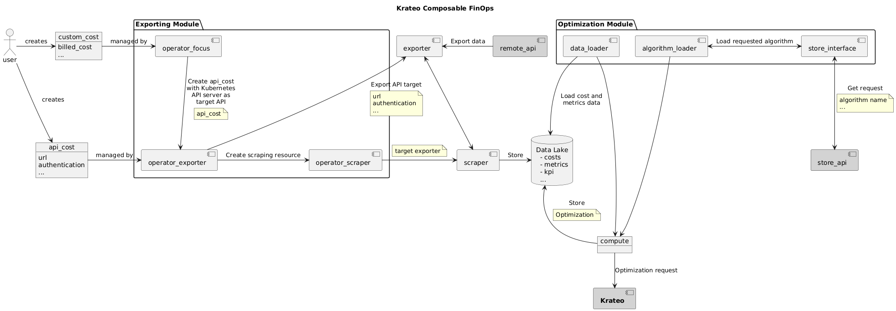

# FinOps Operator VM Manager
This repository is part of the wider exporting architecture for the Krateo Composable FinOps and manages the optimizations that need to be applied to resources on Azure.

## Summary
1. [Overview](#overview)
2. [Architecture](#architecture)
3. [Examples](#examples)
4. [Configuration](#configuration)

## Overview
This component is tasked with applying an optimization to an Azure resource, according to the description given in a Custom Resource (CR).

## Architecture


## Examples
```yaml
apiVersion: finops.krateo.io/v1
kind: ConfigManagerVM
metadata:
  name: # ConfigManagerVM name
  namespace: # ConfigManagerVM namespace
spec:
  resourceProvider: azure
  providerSpecificResources:
    azure:
      Token: 
        name: azure-secret
        namespace: finops
      # resource path in azure, e.g.:
      path: /subscriptions/SUBSCRIPTION_ID/resourcegroups/FinOps/providers/Microsoft.Compute/virtualMachines/VIRTUAL_MACHINE_NAME
      resourceDelta: # int
      action: # start; stop; deallocate; scale-up; scale-down
```

## Configuration
The deployment of the operator needs a secret for the repository, called `registry-credentials` in the namespace `finops`.

### Prerequisites
- go version v1.21.0+
- docker version 17.03+.
- kubectl version v1.11.3+.
- Access to a Kubernetes v1.11.3+ cluster.

### Installation with HELM
```sh
$ helm repo add krateo https://charts.krateo.io
$ helm repo update krateo
$ helm install finops-operator-vm-manager krateo/finops-operator-vm-manager
```

### Bearer-token for Azure
In order to invoke Azure API, the exporter needs to be authenticated first. In the current implementation, it utilizes the Azure REST API, which require the bearer-token for authentication. For each target Azure subscription, an application needs to be registered and assigned with the Cost Management Reader role.

Once that is completed, run the following command to obtain the bearer-token (1h validity):
```
curl -X POST -d 'grant_type=client_credentials&client_id=<CLIENT_ID>&client_secret=<CLIENT_SECRET>&resource=https%3A%2F%2Fmanagement.azure.com%2F' https://login.microsoftonline.com/<TENANT_ID>/oauth2/token
```
